# Kimi K2.5 System Analysis (Prompts + Tools + Skills)

**Abstract:**
Agents have begun to evolve beyond "Tool-Use Architectures" (providing models with discrete APIs) into "Environment Architectures" (providing models with general-purpose computing contexts). This repository explores how Moonshot AI's Kimi K2.5 agent system represents a paradigm shift from the former to the latter.

---

### Quickstart:

1. **[findings/agent-taxonomy.md](findings/agent-taxonomy.md)** - Understand the difference between Kimi Chat (tool-use) and OK Computer (agentic environment).
2. **[reference/infrastructure/filesystem-full.md](reference/infrastructure/filesystem-full.md)** - Explore the persistent filesystem, skill storage, and runtime structure.
3. **[findings/](findings/README.md)** - Read the index for key insights and findings.
4. **[agents/](agents/)** - Browse agent prompts and tool documentation.


---

## Repository Structure

```
kimi-k2.5-system-analysis/
│
├── agents/                                # AGENT CONFIGURATIONS & SKILLS
│   ├── base-chat/
│   │   ├── README.md
│   │   ├── prompt.md
│   │   └── memory.txt
│   ├── ok-computer/
│   │   ├── README.md
│   │   └── prompt.md
│   ├── docs/
│   │   ├── README.md
│   │   └── prompt.md
│   ├── sheets/
│   │   ├── README.md
│   │   └── prompt.md
│   ├── slides/
│   │   ├── README.md
│   │   └── prompt.md
│   ├── websites/
│   │   ├── README.md
│   │   └── prompt.md
│   │
│   ├── skills/                            # Skill definitions & implementations
│   │   ├── docx/
│   │   │   └── SKILL.md                   # DOCX skill definition
│   │   ├── pdf/
│   │   │   ├── SKILL.md
│   │   │   └── routes/
│   │   │       ├── html.md
│   │   │       ├── latex.md
│   │   │       └── process.md
│   │   ├── webapp/
│   │   │   └── SKILL.md
│   │   └── xlsx/
│   │       ├── SKILL.md
│   │       └── pivot-table.md
│   │
│   └── tools/                             # Tool documentation (organized by agent)
│       ├── base-chat/                     # Base chat tools (9 tools)
│       └── ok-computer/                   # OK Computer tools (31 mshtools)
│
├── findings/                              # YOUR INSIGHTS & ANALYSIS
│   ├── README.md
│   ├── agent-taxonomy.md
│   ├── architecture-overview.md
│   ├── base-chat-vs-okcomputer.md
│   └── scaffolding-vs-persona.md
│
├── reference/                             # TECHNICAL ANALYSIS & LOOKUP
│   ├── README.md
│   ├── runtime/
│   │   ├── README.md
│   │   ├── browser-guard.md
│   │   ├── chrome-data.md
│   │   ├── jupyter-kernel.md
│   │   ├── kernel-server.md
│   │   ├── pdf-viewer.md
│   │   └── utils.md
│   ├── system-architecture/
│   │   ├── README.md
│   │   ├── skill-system.md
│   │   ├── skills-analysis.md
│   │   └── tool-dependency-maps.md
│   ├── infrastructure/
│   │   ├── README.md
│   │   ├── container-infrastructure.md
│   │   ├── filesystem-full.md
│   │   ├── supporting-directories.md
│   │   ├── tectonic.md
│   │   ├── workspace-mnt-kimi.md
│   │   └── workspace-mnt-okcomputer.md
│   ├── security/
│   │   ├── README.md
│   │   └── security-model.md
│   └── skills-analysis/
│       ├── README.md
│       ├── docx/
│       │   ├── docx-skill-analysis.md
│       │   ├── docx-skill-workflow.md
│       │   ├── docx-scripts-analysis.md
│       │   ├── docx-templates-analysis.md
│       │   └── docx-validator-analysis.md
│       ├── pdf/
│       │   ├── pdf-skill-analysis.md
│       │   └── scripts-analysis.md
│       ├── webapp/
│       │   ├── webapp-skill-analysis.md
│       │   ├── webapp-skill-workflow.md
│       │   └── webapp-templates-analysis.md
│       └── xlsx/
│           ├── xlsx-skill-analysis.md
│           └── xlsx-skill-workflow.md
│
├── artifacts-sample/                      # EXTRACTED PRIMARY SOURCES
│   ├── README.md
│   └── source/                            # Extracted Python source code
│       ├── browser_guard.py
│       ├── jupyter_kernel.py
│       ├── kernel_server.py
│       └── utils.py
│
├── README.md                              # This file
├── METHODOLOGY.md                         # Research methodology
└── LICENSE                                # CC BY 4.0
```

## How to Navigate This Repository

- **New to Kimi?** Start with [findings/agent-taxonomy.md](findings/agent-taxonomy.md) to understand the two agent types.
- **Want system architecture?** Read [findings/architecture-overview.md](findings/architecture-overview.md) and [reference/infrastructure/container-infrastructure.md](reference/infrastructure/container-infrastructure.md).
- **Looking for specific agent prompts?** Browse [agents/](agents/).
- **Need tool documentation?** Check [agents/tools/](agents/tools/).
- **Want to see skill definitions?** Browse [agents/skills/](agents/skills/).
- **Interested in technical deep-dives?** See [reference/](reference/).
- **Exploring the filesystem?** Start with [reference/infrastructure/filesystem-full.md](reference/infrastructure/filesystem-full.md).

---

## High-Level Architecture:

```mermaid

%%{init: {'theme': 'base', 'themeVariables': { 'primaryColor': '#e9d5ff', 'primaryTextColor': '#1e293b', 'primaryBorderColor': '#c084fc', 'lineColor': '#94a3b8', 'secondaryColor': '#f1f5f9', 'tertiaryColor': '#e0e7ff', 'background': '#ffffff', 'mainBkg': '#ffffff', 'textColor': '#334155', 'nodeBorder': '#cbd5e1'}}}%%
flowchart LR
    subgraph UI["🎯 USER INTERFACE LAYER"]
        direction TB
        NL["💬 Natural Language Requests"]
    end

    subgraph ORCH["🧠 ORCHESTRATION LAYER"]
        direction TB
        IC["🔍 Intent Classification"]
        RT["🚦 Tool Routing"]
    end

    subgraph SERVICES["⚙️ CORE SERVICES"]
        direction TB
        KS["🏛️ kernel_server.py<br/>Port 8888 • 10KB"]
        JK["⚙️ jupyter_kernel.py<br/>PID 300-400 • 17KB"]
        BG["🛡️ browser_guard.py<br/>Port 9222/9223 • 41KB"]
        UT["🔧 utils.py<br/>1.2KB"]
    end

    subgraph SKILLS["📚 SKILL SYSTEM"]
        direction TB
        DOCX["📄 DOCX Skill<br/>Validator .NET • 73KB"]
        XLSX["📊 XLSX Skill<br/>KimiXlsx Binary • 77MB"]
        PDF["📕 PDF Skill<br/>Tectonic • 57MB"]
        WEB["🌐 WebApp Skill<br/>React Template"]
    end

    subgraph DATA["🌍 DATA SOURCES"]
        direction TB
        YF["💰 yahoo_finance"]
        WB["🏛️ world_bank"]
        AR["📚 arxiv"]
        GS["🎓 google_scholar"]
    end

    subgraph INFRA["🏗️ RUNTIME INFRASTRUCTURE"]
        direction TB
        CD["🗂️ chrome_data/<br/>Browser Profile (272 files)"]
        PV["👁️ pdf-viewer/<br/>Extension (387 files)"]
        WS["📁 /mnt/kimi/<br/>upload(RO) • output(RW)"]
    end

    UI --> ORCH
    ORCH --> SERVICES
    ORCH --> SKILLS
    ORCH --> DATA
    SERVICES --> INFRA
    SKILLS --> INFRA

    style UI fill:#e9d5ff,stroke:#c084fc,stroke-width:2px,color:#1e293b
    style ORCH fill:#fbcfe8,stroke:#f472b6,stroke-width:2px,color:#1e293b
    style SERVICES fill:#bae6fd,stroke:#38bdf8,stroke-width:2px,color:#1e293b
    style SKILLS fill:#bbf7d0,stroke:#4ade80,stroke-width:2px,color:#1e293b
    style DATA fill:#fde68a,stroke:#fbbf24,stroke-width:2px,color:#1e293b
    style INFRA fill:#e2e8f0,stroke:#94a3b8,stroke-width:2px,color:#1e293b
```



---

**Methodology:** Cleanroom extraction through the agent's own tools. No authentication was bypassed. No binaries were decompiled. See [METHODOLOGY.md](METHODOLOGY.md) for details.

---

## Legal

Documentation of publicly observable behavior through standard user interfaces. The agent environment provides these capabilities by design. Independent research, not affiliated with Moonshot AI.

CC BY 4.0
